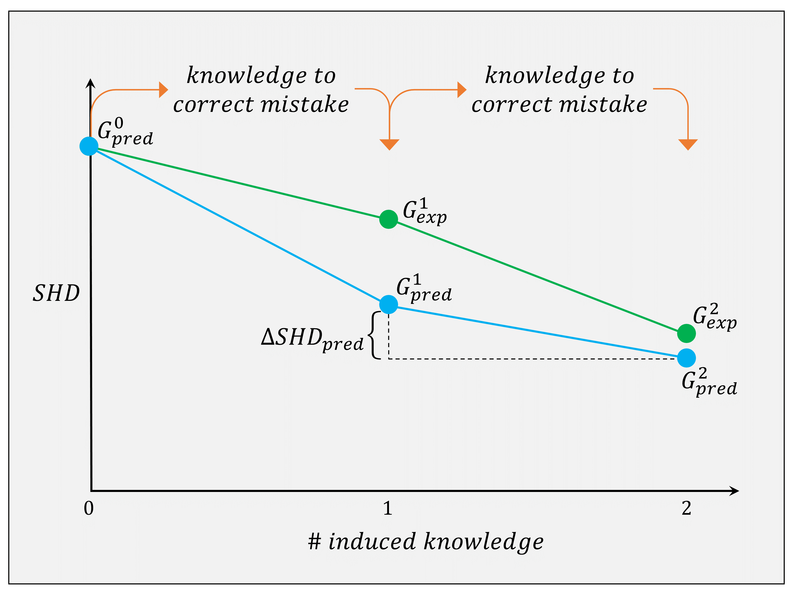
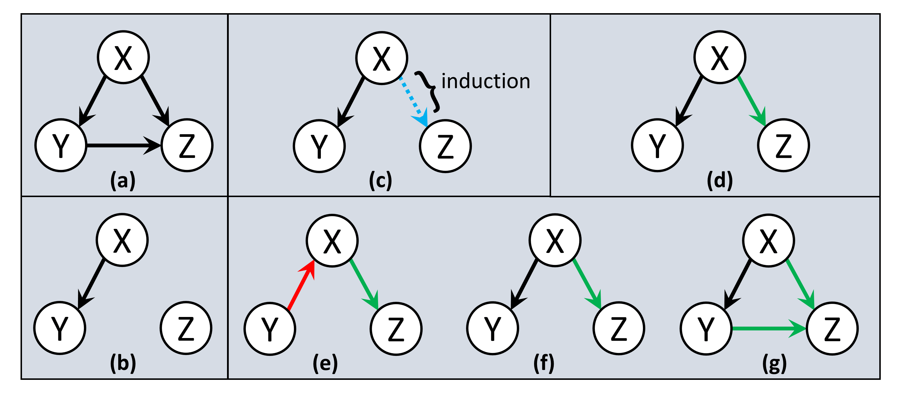

# CausalBias: Causal Structure Learning with Expert Knowledge

This project is associated with the paper titled **"Evaluation of Induced Expert Knowledge in Causal Structure Learning by NOTEARS"**, published in the proceedings of the 12th International Conference on Pattern Recognition Applications and Methods (ICPRAM 2023). You can read the full paper [here](https://www.scitepress.org/Papers/2023/117160/117160.pdf).

## Key Contributions

1. Studied the impact of expert knowledge on causal discovery by incorporating additional constraints into the nonparametric NOTEARS framework.
2. Demonstrated that correcting mistakes using expert knowledge can lead to statistically significant improvements in causal structure learning.
3. Compared the effects of active versus inactive edge constraints and found that constraints on active edges have a larger positive impact.
4. Provided insights on the effectiveness of induced knowledge using synthetic and real-world datasets.

## Visualizations

1. **Knowledge Induction Visualization**  
     
   This plot shows the effect of knowledge induction on causal structure learning.

2. **Expected Graph Formulation**  
     
   This plot visualizes the expected graph formulation when incorporating causal knowledge.

## Dependencies

This source code extends the NOTEARS implementation and as a result includes copies of the original NOTEARS files. Some of these files have been modified to accomodate for the incorporation of the causal knowledge.

For the original NOTEARS source code please refer to [https://github.com/xunzheng/notears](https://github.com/xunzheng/notears).

## Instructions to Run the Code

To generate synthetic data and run the model, please follow the script 'demo_synthetic.py'. The script creates and run the model based on the parameter setup.
To tune the model, please use the following parameters:

```
n: number of samples.
list_n: list of options for n.
d: number of features in each sample.
list_d: list of options for d.
s0: number of active edges in the true causal graph.
list_s0_factor: list of options for s0_factor where s0 := s0_factor * d.
graph_type: type of the graph to be generated i.e. 'ER'(erdos-renyi), 'SF'(scale-free).
list_gt: list of options for graph_type.
sem_type: type of nonlinear SEM.
list_sem: list of options for sem_type.
list_graph: list of graph combinations. 

l1l2: regularizing parameter for l1,l2.
w_threshold: threshold to prune edge with weight below this value. 
hidden_units: number of hidden units in the MLP.
exp_no: experiment no.
ntrial: number of trials. 
		Each of these trials runs sequentially until the terminating condition satisfies. 
knowledge_source: source of knowledge to be incorporated. 0: mistake, 2: correctly classified set.
knowledge_type: type of edges to be incorporated as knowledge. 0: known inactive, 1: known active, 2: (both) known inactive & active.
```

The interactive modeling mechanism runs initially without imposing any constraints or knowledge (method 'run_initial()'). In following steps, based on the prior findings and output DAGs, 
it systematically runs experiments (method 'run_iterative()') adding one knowledge with randomization based on the knowledge source and knowledge type defined. 

## Example of Mask Incorporating Knowledge:

To incorporate an inequality constraint (known active edge) such as causal relation from (node 1) to (node 2) in a graph with 3 nodes (node 0, node 1, node 2), 
the mask (numpy array) takes the form as follows:

```
[[nan, nan, nan],
 [nan, nan,  1.],
 [nan, nan, nan]]
```

To incorporate an equality constraint (known inactive edge) such as imposing no causal relation from (node 1) to (node 2) in a graph with 3 nodes (node 0, node 1, node 2), 
the mask (numpy array) takes the form as follows:

```
[[nan, nan, nan],
 [nan, nan,  0.],
 [nan, nan, nan]]
```


